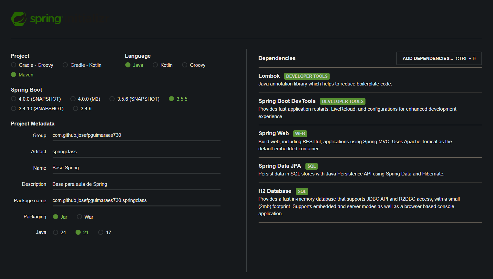

### Udemy Spring Especialista
Project based on course: \
[www.udemy.com](https://www.udemy.com/share/102JK83@PC72nb8818rzCuyfbmhCgY1e7_EpiC3NaGzwqWQjoDrihv32DgbVE4pREGexsoCi/) \
Oficial lesson's repository: \
https://github.com/cursodsousa/curso-spring-boot-especialista \
Oficial lesson's documentation \
[https://whimsical.com/curso-sboot-expert](https://whimsical.com/curso-sboot-expert-CKxrH3Bcd65xsfS6TibJqX)

Pre-requisites:
- JDK 21
- IntelliJ Community
- Postman
- Docker

Spring Start configuration

